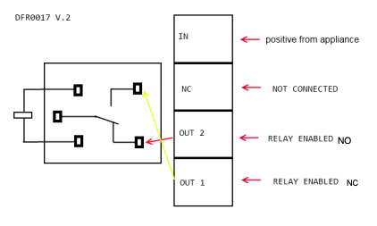

# garage-door

This project is to use an ESP8266 to open and close a garage door.

## Interfaces

- Alexa
  - This currently needs a refactor to be discoverable. It's a nice to have.
- Web - for Shortcuts.app & Siri

## Design

- Relay
  - The relay needs to be initialized in the setup block
    - Needs to set to `HIGH` immediately, or could trigger a door open. The garage door opener and the controller should probably be plugged in via powerbar/block
  - Using the `RX` pin on the NodeMCU, which is GPIO 3
  - Relay requires 5V in(using VIN), to overcome the activation barrier of 3.8V. The 3.3V makes a light click, but does not activate the relay
  - Input is `IN`, output is `OUT2`

## Blockers

- [ ] Currently not discoverable by Alexa due to library issues

## Components

- ESP8266 with serial on board- NodeMCU

- Relay - [DF Robot 10A relay Datasheet](components/datasheet-dfr0017.pdf)

## NodeMCU Pinout

## Resources

- https://www.iliketomakestuff.com/make-an-alexa-controlled-finger/
- https://github.com/iliketomakestuff/alexa_controlled_finger
- https://github.com/makermusings/fauxmo - Python version, basis for the Arduino lib
- http://tinkerman.cat/emulate-wemo-device-esp8266/
- https://bitbucket.org/xoseperez/fauxmoesp
- https://github.com/tzapu/WiFiManager - Dynamically join the proper wifi network without hardcoding
- https://github.com/esp8266/Arduino/tree/master/libraries - builtin libraries
- https://tttapa.github.io/ESP8266/Chap08%20-%20mDNS.html
- https://www.dfrobot.com/wiki/index.php/Relay_Module_(Arduino_Compatible)_(SKU:_DFR0017) - DFRobot example code for running the relay
